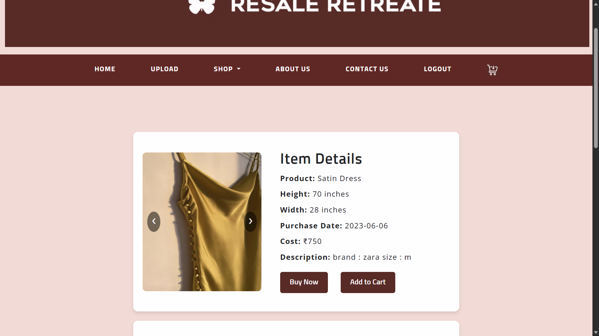
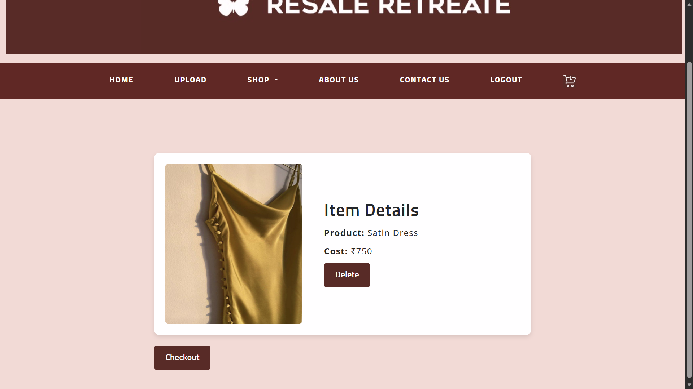
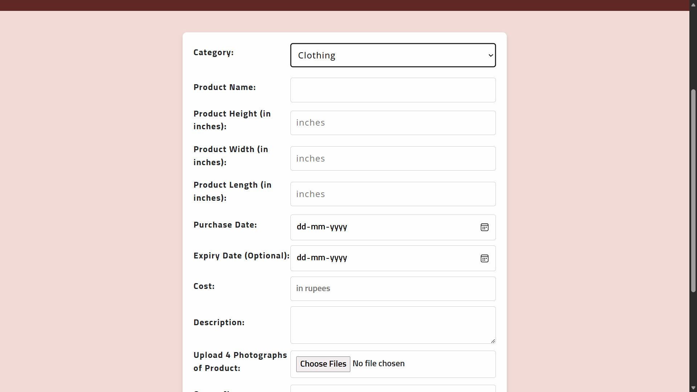
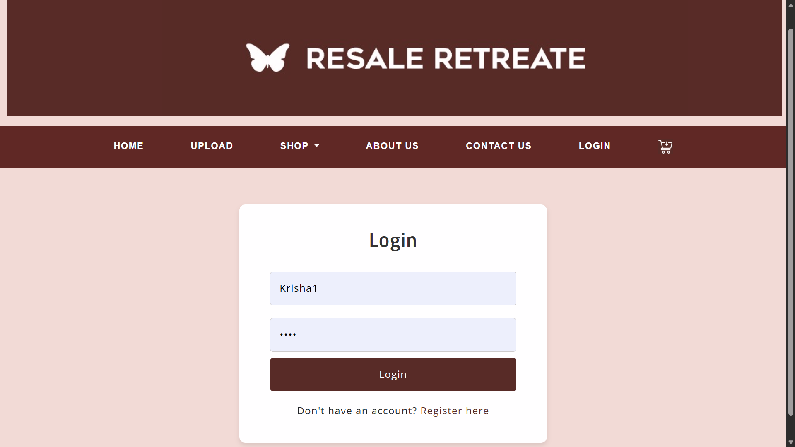

# 🛒 Resale Retreate

Resale Retreate is a full-stack second-hand e-commerce web application built using **PHP and MySQL**.  
Users can upload their used products, browse listings, add items to the cart, and complete purchases through a checkout system with payment integration.

---

## 🚀 Key Features

- User Registration & Login
- Upload products for sale with images and details
- Browse available items (Shop page)
- Product details page
- Add items to Cart
- Checkout and Payment system
- Order confirmation
- Navigation pages: About Us, Contact Us
- Responsive design for desktop and mobile

---

## 🖥️ Pages Overview

- **Homepage:** Welcome page with navigation
- **Shop:** Browse all uploaded products
- **Cart:** See selected products
- **Checkout:** Complete your order
- **Upload Product:** Add your own product for sale
- **Login/Register:** User authentication
- **About Us / Contact:** Information and contact form

## 🛠️ Tech Stack

- Frontend: HTML, CSS, Bootstrap, JavaScript  
- Backend: PHP  
- Database: MySQL  
- Server: Apache (XAMPP)

---

## 💻 How to Run Locally
1. Install **XAMPP**
2. Move project folder into:
C:/xampp/htdocs/
3. Start Apache & MySQL
4. Import database via phpMyAdmin
5. Open in browser:
http://localhost/Resale-Retreate

## 📸 Screenshots

